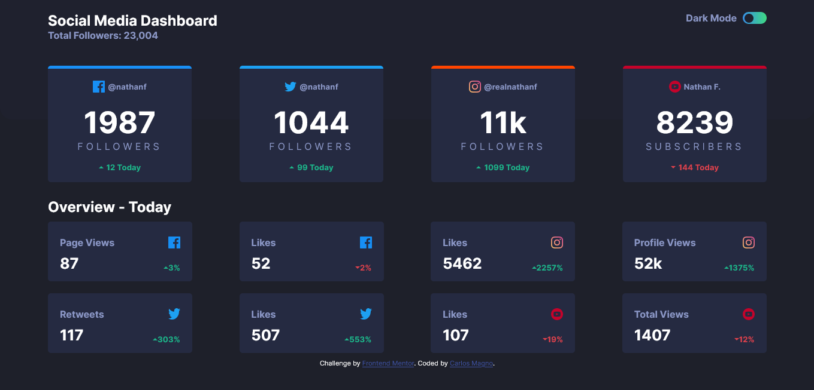
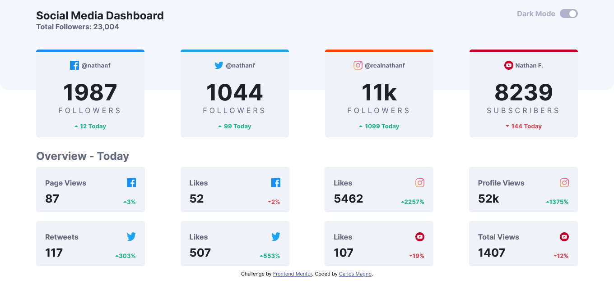
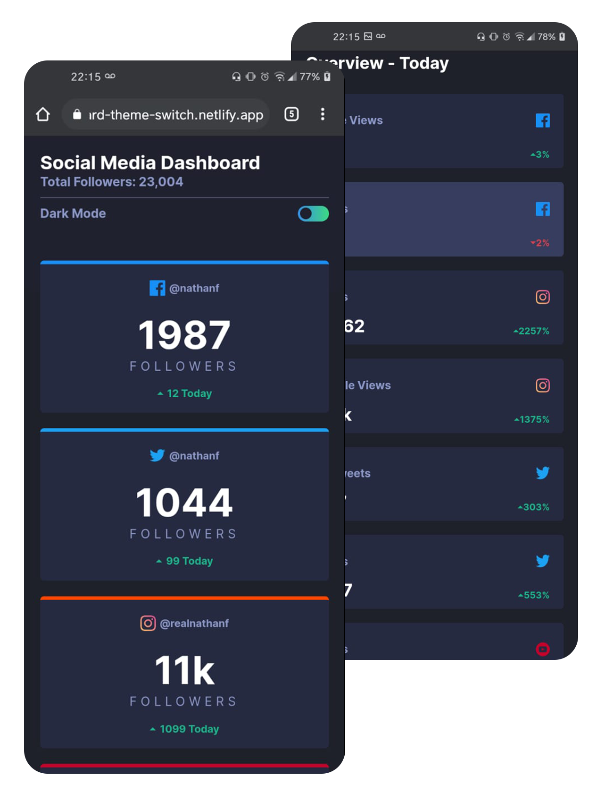
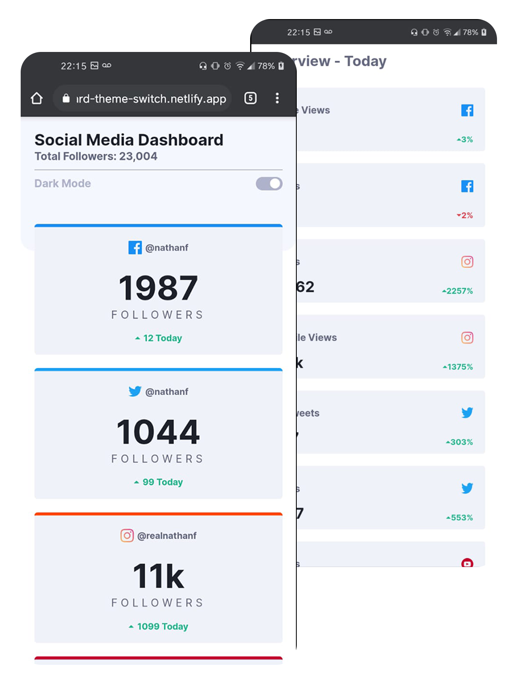

# Frontend Mentor - Social media dashboard with theme switcher solution

This is a solution to the [Social media dashboard with theme switcher challenge on Frontend Mentor](https://www.frontendmentor.io/challenges/social-media-dashboard-with-theme-switcher-6oY8ozp_H). Frontend Mentor challenges help you improve your coding skills by building realistic projects. 

## Table of contents

- [Overview](#overview)
  - [The challenge](#the-challenge)
  - [Screenshots](#screenshot)
  - [Links](#links)
- [My process](#my-process)
  - [Built with](#built-with)
  - [What I learned](#what-i-learned)
  - [Continued development](#continued-development)
- [Author](#author)

## Overview

### The challenge

Users should be able to:

- View the optimal layout for the site depending on their device's screen size
- See hover states for all interactive elements on the page
- Toggle color theme to their preference

### Screenshots






### Links

- Solution URL: [Social Media Dashboard Repository](https://github.com/carlosmagno02/Social-media-dashboard-with-theme-switcher)
- Live Site URL: [Social Media Dashboard Site](https://social-media-dashboard-theme-switch.netlify.app/)

## My process

### Built with

- Semantic HTML5 markup
- CSS custom properties
- Flexbox

### What I learned

##### Dark Mode
```js
const btn = document.getElementById('btn')

btn.addEventListener("click",(e) =>{
    document.body.classList.toggle('white')
})
}
```

### Continued development

Keep training html,css and improve javascript skills


## Author

- Repository - [Carlos Magno](https://github.com/carlosmagno02)
- Frontend Mentor - [@carlosmagno02](https://www.frontendmentor.io/profile/carlosmagno02)
